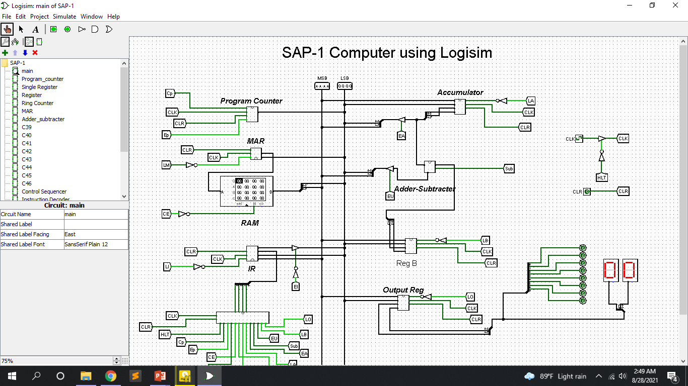

# SAP-1 Computer using Logisim

A SAP-1 computer with multiple modules and circuits. The whole circuitry was built in Logisim software.

## Motivation
This project is made for Digital System Design Laboratory (CSE 4224).

## System Overview

            
     Figure-1: Flow diagram of SAP-1 Computer using Logisim.
